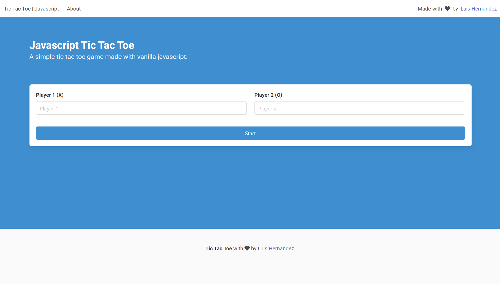
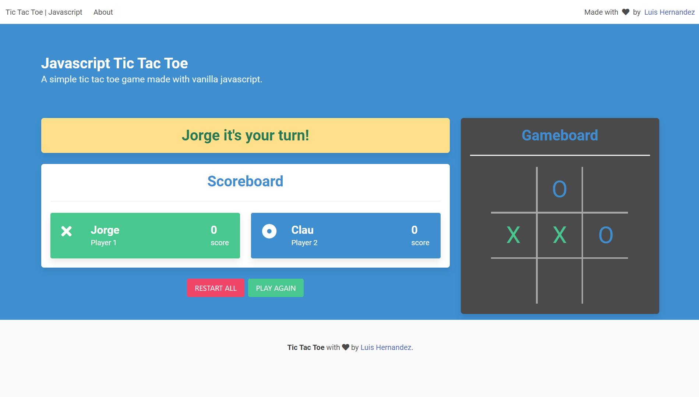

# Tic Tac Toe | javascript

## Short Description:
Tic Tac Toe is a web application that allows users to play the classic game of Tic Tac Toe against each other. The app is built with vanilla JavaScript and Bulma CSS and is responsive. It includes a form for entering player names and a score counter that tracks the number of wins for each player.

## Previews:

## Live Demo:
[Live Demo Link](https://luishernandezcoding.github.io/tic-tac-toe-javascript/)

## Long Description:
Tic Tac Toe is a simple web application that allows users to play the classic game of Tic Tac Toe against each other. It includes a form for entering player names and a 3x3 grid for playing the game. The app tracks the number of wins for each player and displays the score. The player who loses the current game starts the next game.

The app is built with vanilla JavaScript and utilizes an object to store game information. It is styled using Bulma CSS and is responsive. The app includes a form for entering player names and buttons for resetting the game and displaying the game rules. The game board is displayed using plain HTML. The game and score information is only stored for the current session and is not persisted beyond the current page refresh.

## Features:
- Play the classic game of Tic Tac Toe against a friend
- Enter player names
- Reset the game
- Track the number of wins for each player
- Responsive design using Bulma CSS

## Learning Outcomes:
- How to build a web application with vanilla JavaScript and HTML
- DOM manipulation
- Objects and factory functions
- Objects and Modules
- Bulma CSS
- Responsive design
- How to store and manipulate data using an object

## Topics of Interest:
- JavaScript
- HTML
- Bulma CSS
- Responsive design
- Linters

## Made with:
- JavaScript
- HTML
- Bulma CSS
- VSCode
- Git
- Github

## Contributing:
We welcome contributions to this project! If you have an idea for a new feature or have found a bug, please open an issue or submit a pull request.

## Author:
👤 **Luis Hernandez**

- GitHub: [@LuisHernandezCoding](https://github.com/LuisHernandezCoding)
- LinkedIn: [Luis Hernandez](https://www.linkedin.com/in/luis-hernandez-coding/)

## Credits:
- [The Odin Project](https://www.theodinproject.com/)
